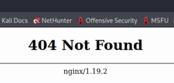

# Como ocultar a versão do servidor NGINX do cabeçalho

Por padrão o NGINX retorna a assinatura do servidor em cabeçalhos de resposta. Essas informações contêm descrições como nome e versão do servidor.
Essas informações de strings de servidor podem ser usadas indevidamente por invasores. Visto que o nginx possuí algumsa vulnerabilidades públicas, uma boa prática seria esconder a versão do serviço. Na verdade essa é uma das etapas principais para manter o nginx seguro.

## Porque ocultar a versão do servidor NGINX do cabeçalho

Geralmente, quando um usuário solicita um link indisponível, ou quebrado em um site, ele recebe uma mensagem de erro do NGIX. Essa mensagem contêm e nome e versão do servidor.

Como pode ser visto, a string do NGINX contêm o nome e a versão do servidor. Isso pode facilitar para um hakcer invadir seu site, e até mesmo o serivdor. É muito importante ocultar essas informações.

## Como ocultar a versão do NGINX

Seguem abaixo os passos para ocultar a string do NGINX

### 1 - Abra o arquivo de configuração do NGINX

Abra com seu editor de preferência o arquivo nginx.conf.

    # vim /etc/nginx/nginx.conf

### 2 - Oculte a versão e o nome do Servidor NGINX

As informações do servidor NGINX podem ser ocultadas usando o cabeçalho 'server_tokens'.
Adicione a seguinte linha ao bloco http

    http{
        ...
        server_tokens off;
        ....
    }
### 3 - Reinicie o NGINX

Execute o comando abaixo para ver se a sintax do seu arquivo está tudo certo.

    # nginx -t

Não econtrando nenhum erro, faça um reload e restart do serviço NGINX

    # systemctl reload nginx.service
    # systemctl restart nginx.service

Verifique o status do serviço

    # systemctl status nginx.service

Serviço atualizado! A versão do servidor e do NGINX não aparecerão mais!

